### Some quick numbers about the journey:

* Started with ~$3,000 (after $1k for AirBnb, $750 for computer, $150 for phone, I had ~$1,500 left)
* Took 1 year and 8 months
* 1 stolen bike
* $1,000/month for rent
* 3 different apartments
* 9 roommates at 1 apartment
* Lived with 2 roommates in one room
* 5 different gig jobs
* 1,000+ miles biked
* Accepted to 2 coding bootcamps (kicked out of 1)
* Dozens of phone screen and coding challenges
* Over 1,000 applications/emails
* 1 offer
* $67.5K salary

I was able to move to San Francisco, with basically nothing, learn how to code, and got a job as a Software Engineer after 1 yr 8 months. And the only outside money I took was an initial $3k student loan. 

Here’s how I did it. 

### The Journey
In late 2016 I was about to graduate college.

Problem was, I didn’t have a job lined up, or any money saved up either. 

In fact, I was actually $10k in debt from student loans. 

Annnnnd, I was graduating with a Psych degree, which, let’s be honest, is pretty meaningless. 

I did do 3 internships while in school, so that helped my resume out a little.

I did my internships in Human Resources, for 1 small retail company, and 2 large manufacturing companies.

Very glad I did those because it helped me figure out a couple of things about myself:
1. Small companies are more fun to work at
2. The industry I go into is important. Tech is hot and making people's lives better, whereas manufacturing is old without much of a mission.

And I also heard about revolutionary tech companies like Airbnb and Uber, which I was unaware of before.
Being from a small town, I also wanted to live in a big city where people were changing the world. 

I wanted to work in San Francisco at a startup, but I had 0 prospects or contacts there, no money, didn’t know how to code, and I was living in Rexburg, Idaho.

But I thought, if I just apply enough places, I’ll hear back from someone, it's just a numbers game. 

Since my background was in Human Resources, I looked for open positions at startups that looked like something I would qualify for. 

I applied to about 100 places and only heard back from one company, which was actually a real estate firm, not a startup.

The conversation ended pretty quickly though when the Hiring Manager realized that I wasn’t living in the Bay Area. “Do you know how expensive it is to live here?” she said, “It's the most expensive city in the world to live.”

And she was right. 

The positions I was applying to made about $50k/yr, and rent for a single bedroom in San Francisco was about $2k. 

But I thought, the real reason I’m not hearing back from people, is my address says Rexburg, ID, but if it said San Francisco, CA, I bet I would have much more success. 

At this point I was only 2 months away from graduating, so I simultaneously was applying for jobs in Utah, where rent was cheaper, I had more contacts, and I could drive to if I had an interview. 

The problem with Utah was there were just not as many startups, and definitely not many that needed someone who couldn’t code.

I did get a couple of phone screens, but never had an onsite. 

I finally reached out to one of my buddies working at one of the most successful tech companies in Utah, called Qualtrics, and eventually got a phone screen for a Recruiting Coordinator position. 

I was pretty nervous, the recruiter could probably tell. I was prepared for all these questions, pieces of cake. But as she kept asking me questions, I got the impression she was just going through the motions. She seemed completely disinterested in me. It's like she was doing some other work while on the phone with me.

That really killed any excitement I had for this opportunity. Here I was, kind of settling for this opportunity, and they didn’t even want me?

After that, I just thought, Eff it! I’m not settling! I want to aim for the freaking stars!

I’m gonna do whatever it takes to accomplish a huge goal like getting a job in San Francisco. I have always been really competitive and why would I back down from a challenge now?

I knew it would be a struggle for the first couple years, but it seemed like working in the Bay was a wise investment. And if things just weren’t going to work out, I could always move to Utah or back home to Ohio. 

So before hearing back from Qualtrics, I told them that I respectfully withdrew from the interview process, and started to make preparations for moving to San Francisco.

### Preparations
I figured that if I can just get a place for a month that I could just figure things out after I got there.

So first I started to look at hostels, which were gonna be around $1k/month. Then I thought I might as well check out Airbnb, since that would probably be a little better than a hostel.

Turns there were a few places that I could book, for around the same price. And to be clear, I would be booking a bed, so it was pretty similar to a hostel, but at least I had access to a kitchen, and it wasn’t just day to day with a bunch of rando’s day to day.

Ok so I found housing for a month, now I need to figure out how to pay for it. 

I didn’t have a credit card at the time and wasn’t going to ask for money from anyone, so I had to think about where to scrounge together about $2k. 

Then I remembered an unsubsidized student loan that I turned down earlier that semester!

I checked what the amount was, and it was $3,500! Perfect! However, I was crossing my fingers hoping that I could still take that money out after declining it. Turns out I could! (Even though it wasn’t necessarily for school... appreciate that Uncle Sam 😁)

After it was all said and done I received a little over $3k. I actually didn’t have a computer or smartphone at the time and thought that those would probably be wise investments, so I bought a used MacBook Air from Amazon for $700, and an iPhone from WalMart for $150. And with the apartment for $1k, that left me with over $1k to spare!

I was all set. 

### Christmas Break
After I graduated, I flew home for Christmas. While there I started applying to places in San Francisco, but this time I used my Airbnb address, and sure enough, I started getting phone calls! I KNEW if I just had an SF address that I would get bites.

One company that interviewed me was this coding bootcamp called App Academy.

I had never heard of a coding bootcamp before. I thought it was really cool that they were teaching people how to code.

I knew I wanted to learn how to code eventually, so I thought it would be really cool to work there, and take advantage of their curriculum to learn how to code.

But I didn't event get an on site...😞

But I did end up getting 2 on sites at other companies!!

...which I foolishly scheduled the day after I was planning on leaving for San Francisco 😬 whoops. 

### Moving to San Francisco
I was leaving in January, from Salt Lake City (because I parked my car there).

Here's a little of what my car looked like. 

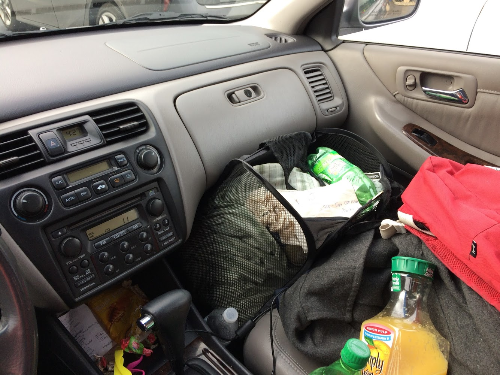

I think the GPS said it was a 14-hour drive. So I figure I’d leave at 7am, then get there in the evening. Piece of cake.

Yeah turns out you have to go over actual mountains on your way to SF from Utah, and uh, that's not a great idea in January. 

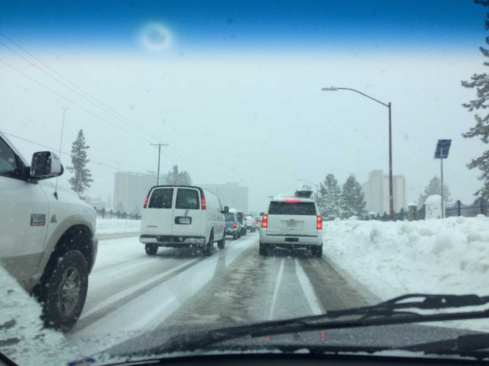

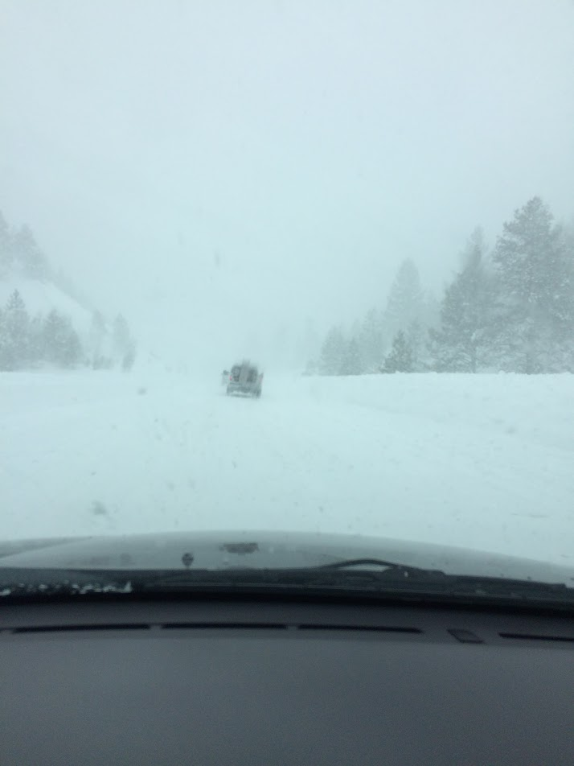

It's honestly a miracle I didn't ever get stuck. I was driving a Honda Accord with bad tires.

It only ended up taking 2 (VERY stressful) days.

### Finally in San Francisco
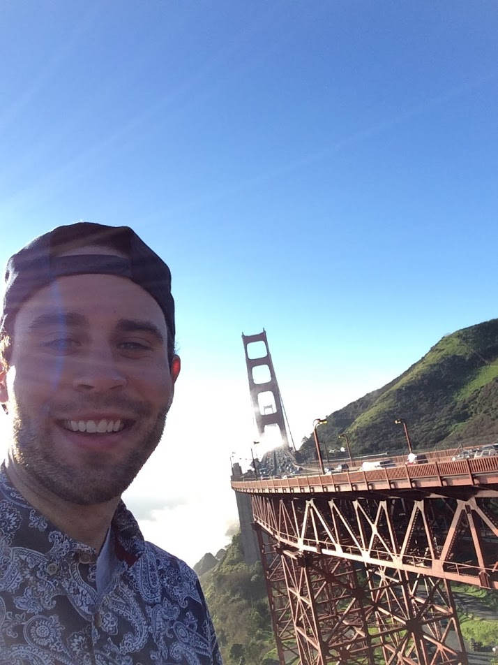

After doing some sight seeing, I had to figure out what the heck I was gonna do to find a job. 

BTW, here's some pics of the Airbnb I was at 😬

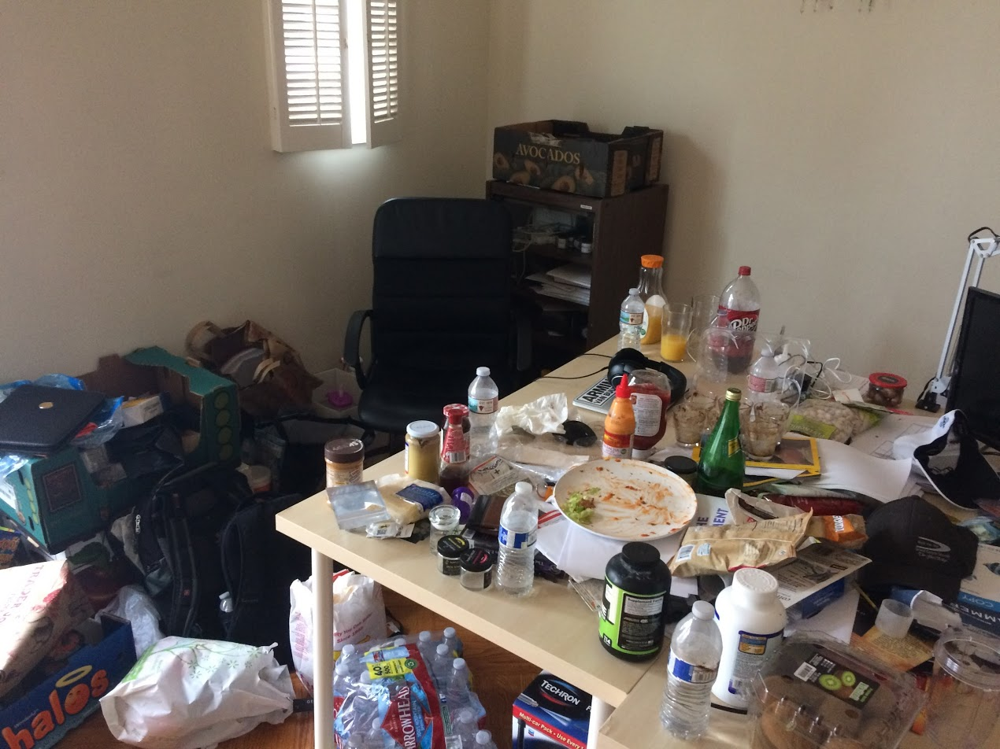

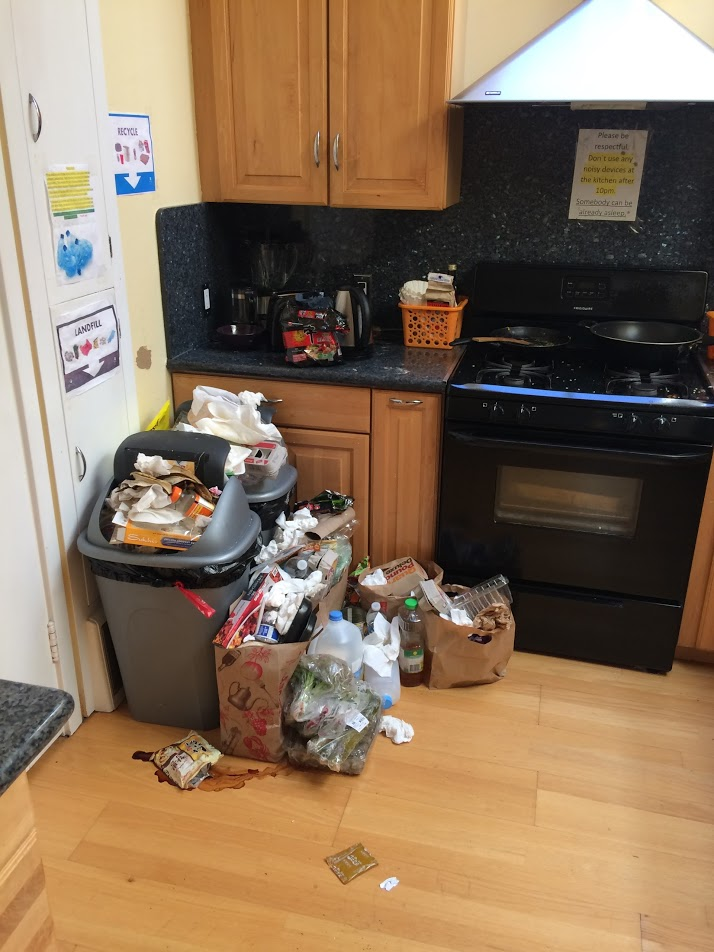

I applied to any position at a startup I thought I could get.

I also signed up with some temp agencies.

That yielded a few interviews. No offers.

I was also running out of money. Serendipitously I went to the mall by San Francisco State University and a guy was recruiting delivery drivers for Uber Eats.

That was an enormous blessing. Cause I could work whenever I wanted to, and as much as I wanted to.

So delivering food kept me afloat.

Ok so back to getting a startup job...

I started getting a little more sophisticated in applying and started tweeting at CEO's.

I had much more success at getting interviews.

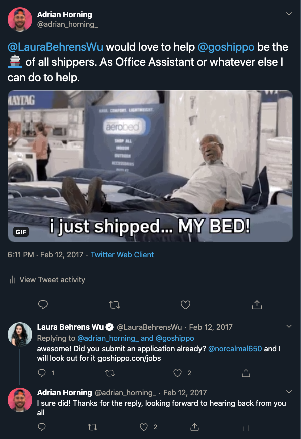

But after a month of applying for these jobs, I kept thinking:
1. These jobs only pay $40-$50k. Terrible for SF.
2. I bet if I learned how to code I could find a job easier and make more money
3. If I'm working my butt off for a low paying job, why not work my butt off for a higher paying job?

I also kept thinking about App Academy, the company I had a phone screen with. 

If I learned how to code, I could probably make a lot more money.

So I Googled App Academy again, and [an interview the founder, Kush Patel, did on a podcast popped up.](https://breakingintostartups.com/kush-patel-founder-of-app-academy/)

After hearing this interview I was SO PUMPED!!!

Then I listened to other interviews done by [Breaking Into Startups](https://breakingintostartups.com/) and people just like me got jobs as software engineers making over $100k after going to one of these coding bootcamps.

These podcast episodes were insanely inspiring. 

I wanted to talk to one of their guests to I decided to reach out to one of their guests.

I tweeted at Albrey Brown, and I didn't hear back from him, but heard back from one of his friends:

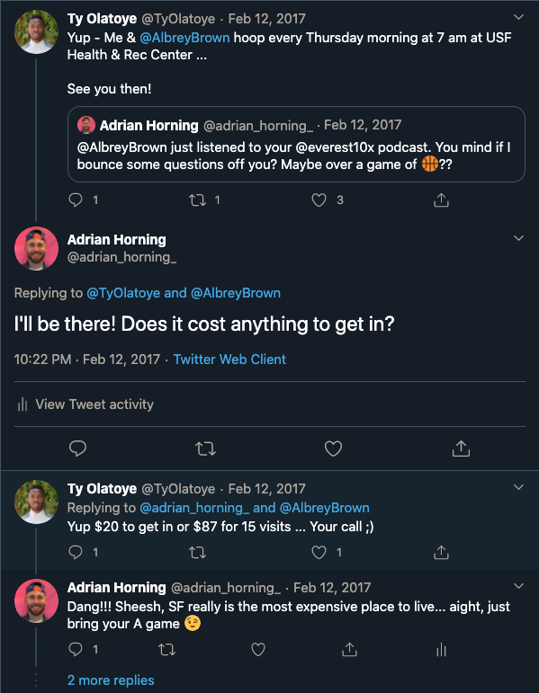

Boom. I was headed to basketball. 

After kickin everyone's butt (jk, I sucked), I talked to Ty. 

That talk with Ty changed my life. 

Ty really made me see that this was the perfect time in my life to learn how to code.

I had all the time in the world, no family, no job, it would be a hugely beneficial skill to have, and would be financially compensated well.

And anyone can do it.

If you’re willing to put in the time, anyone can learn how to code. 

So I decided I was going to do it! I was going to learn how to code!

I was going to stop applying for jobs and focus on learning how to code and getting into one of these coding bootcamps. 

But now, I had to learn how to code 😬

Yikes!!!

### Learning How to Code

Honestly, getting started was VERY frustrating.

I didn’t know where to start.

I went to one of these coding challenge websites called Codewars, and I didn’t even know where to enter my code. I was so confused.

Eventually, I realized I needed to get some context, like why would I ever want to use a for loop in real life? I needed to see a practical example of how code was implemented. 

Then I stumbled upon [Gordon Zhu’s Watch and Code course.](https://watchandcode.com/)

That was extremely helpful because we built a simple todo list application in JavaScript and I could see what I was doing come to life on the screen, and how things I was learning applied to a real world application. And Gordon was extremely helpful, he took time to video chat with me, and he hosted office hours every Monday. Highly recommend his course. 

After Gordon’s course, I spent everyday for 3 months on Codewars, practicing similar coding challenges that I would see on the bootcamp entrance tests.

I would go to the San Francisco State library (really nice library btw) at about 9, then go home at 7 or 8, eat dinner, then do it all over the next day. 

Someone gave me the advice that if I could do about half of the kata 5 challenges on Codewars, that I could pass App Academy’s coding challenge easily. 

I can attest that that was the case.

During this time I would drive for Lyft for a week or two so I would have enough money for rent and food for a month or so. 

It took me about 3 months to feel confident that I would pass the bootcamp coding challenges.

And my hard work paid off! I got accepted to Hack Reactor and App Academy! The top 2 coding bootcamps in the country. 

I thought Hack Reactors coding challenge was much more difficult. I think you pretty much have to do their Structured Study Program in order to get in. Their prep material mirrored their actual test very well. But if you didn’t do their prep material, the test was extremely hard, at least for me.

I wanted to go to App Academy, but I decided to go to Hack Reactor because they partner with companies who will let you take out a loan for housing and the course, even if you don’t have a job.

But with App Academy I would've needed to save $6k to pay for the initial payment and housing. So I went with Hack Reactor because I could attend sooner. 

So I was accepted into the October cohort! I could’ve made it into an earlier cohort, but there was prep work I needed to do, and I didn’t think I could have it done in time. 

At this point I actually sold my laptop because I ran out of money. Really good timing considering I just passed the coding challenges. 

And I finally moved out of my original Airbnb (thank goodness) and moved into a place specifically with other people going to bootcamps called Cohort-X, which was a great place to live. 

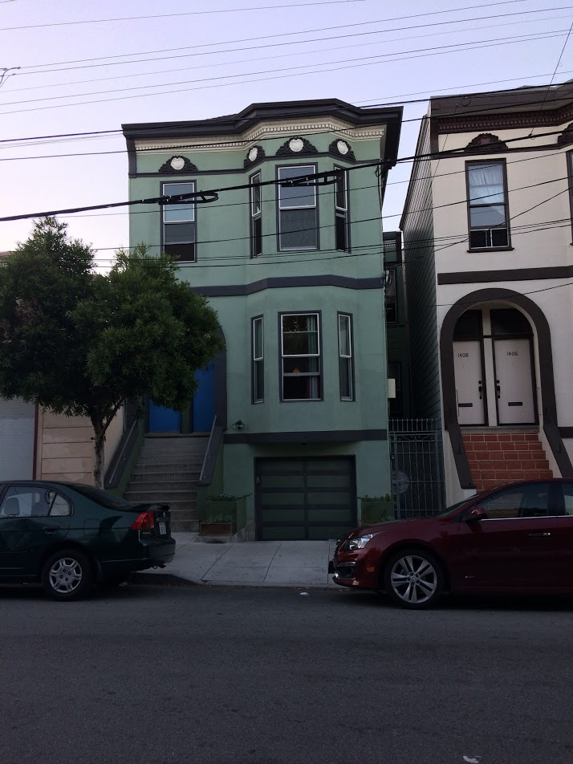

### A Detour

2 weeks before my cohort start date, we got emails saying we needed to schedule a non-technical interview with someone from Hack Reactor. 

Ok, whatever, I’m sure they just want to make sure I’m not crazy. 

A day or 2 after my non-technical interview I get an email saying that I was “conditionally accepted”, which was weird because I was already accepted. 

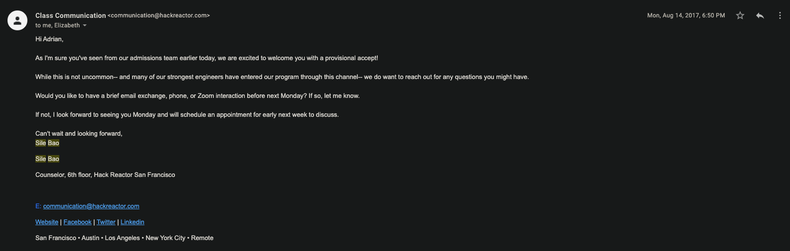

I was obviously curious about why I was conditionally accepted, so I sent a reply,

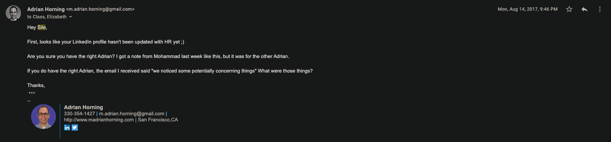

Then I got this email:

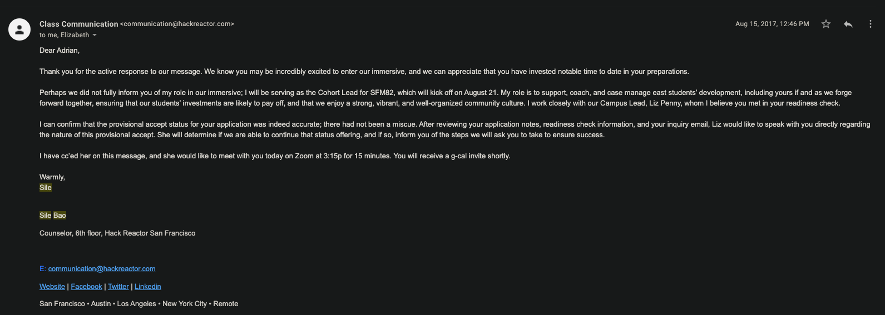

Uh oh. That doesn’t seem good. 

So I hop on a video chat with the person who interviewed me, Liz Penny, who was Dean of Hack Reactor at the time.

I asked her why I was conditionally accepted and she said she didn’t like that I said I had a “fiery personality” and that my reply email (above) was “very inappropriate.”

I could tell she wanted me to just bend over and accept what she was saying, but her reasoning was ridiculous and so I disagreed that my email was inappropriate, after which she said that I would have to wait a few cohorts to be enrolled. 

Which, is weird, because what would we be waiting for? For me to kiss her butt??

Nah, I’m good. 

So I said🖕to Hack Reactor.

And bear in mind, this was 6 DAYS BEFORE OUR COHORT WAS SUPPOSED TO START!!!!!

Like, if you wanted to have these non-technical interviews, that's cool. But do it after I pass the technical interview. That's what App Academy does.

Don't accept me, then a week before say that there is an extra interview, which was not part of acceptance. 

So unprofessional. 

I even reached out to the founders of Hack Reactor on Twitter, but they never got back to me. Very disappointed in Sean Drost and Marcus Phillip, the founders of Hack Reactor. 

Now I had to get accepted to App Academy again, which wasn’t a problem, but THEY CHANGED THEIR TUITION MODEL!!!!

Instead of taking a percentage of your first year's income, they were now taking a flat $28k from you, which ended up costing me about $10k when it was all said and done. 

And now, I had to figure out where I was going to come up with $12k to pay for App Academy. 🤦‍♂️

So, I went back to work driving for Lyft, and drove every day, for 8-10 hours a day. 

But, I hated driving. In San Francisco it was an absolute nightmare. Worst job I have ever had (and I've had to clean toilets at 3am).

But, I had a very fortunate accident, effectively ending my career as a driver because I had to return the car to them that I was renting. 

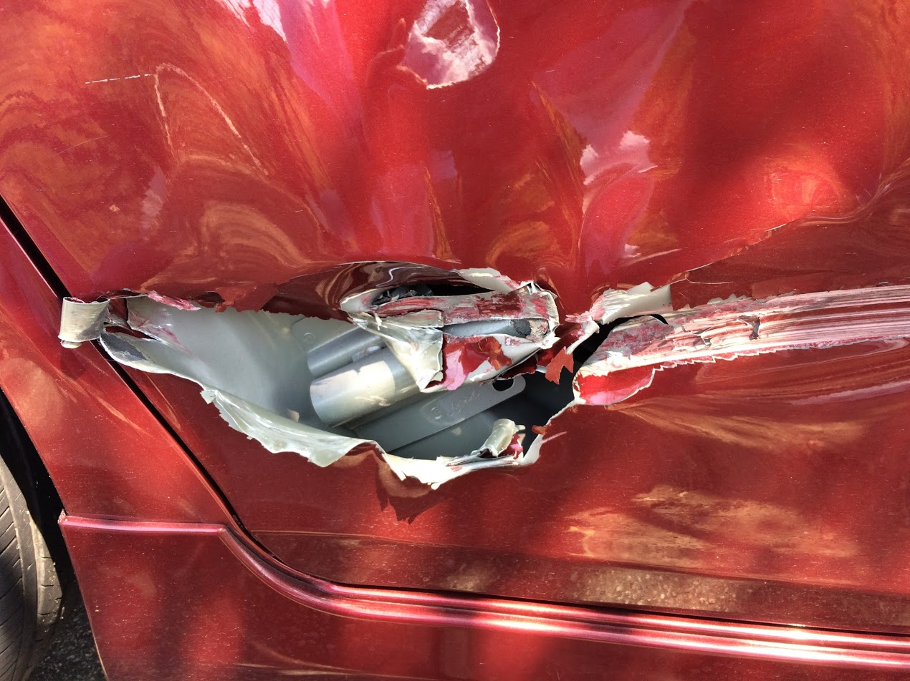

BUT, I found a much more chill job, and made me more money, which was bicycle courier. 

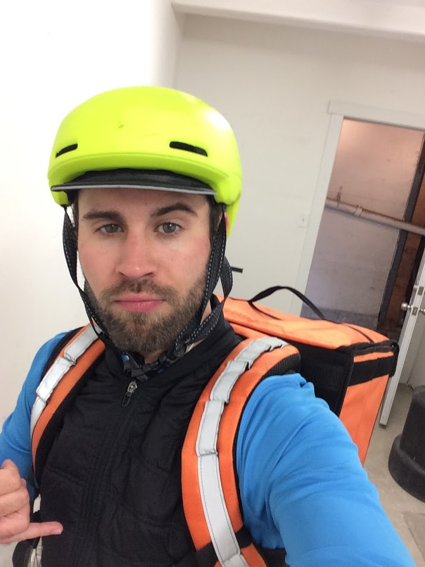

I delivered food for Caviar. (The food wasn’t actually caviar, that's just the name of the company)

I worked EVERY SINGLE DAY for 4 months.

I delivered lunch from 11am - 3pm. Then dinner from 5pm - 10pm.

I delivered in the heat, the rain, and the smoke ([it was when there were fires in the north bay](https://en.wikipedia.org/wiki/2017_California_wildfires)).

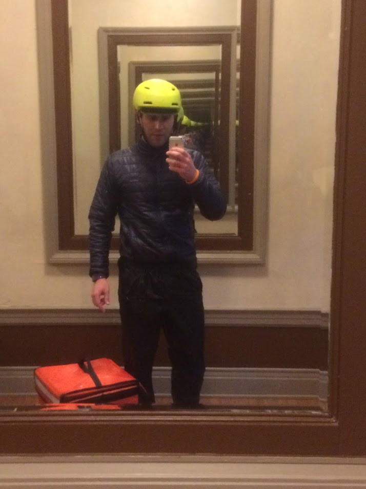

Handle bar broke while I was riding it.

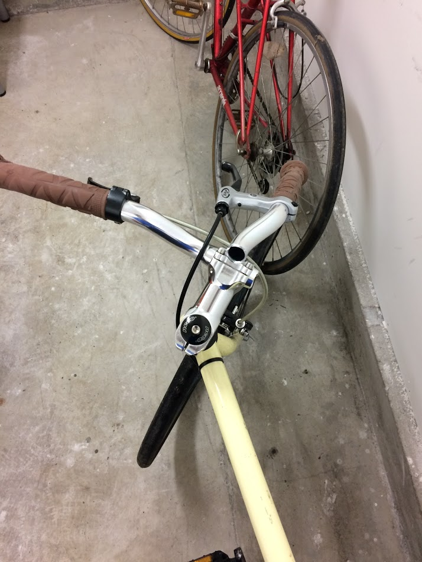

And got my wheel stolen (and 4 or 5 lights).

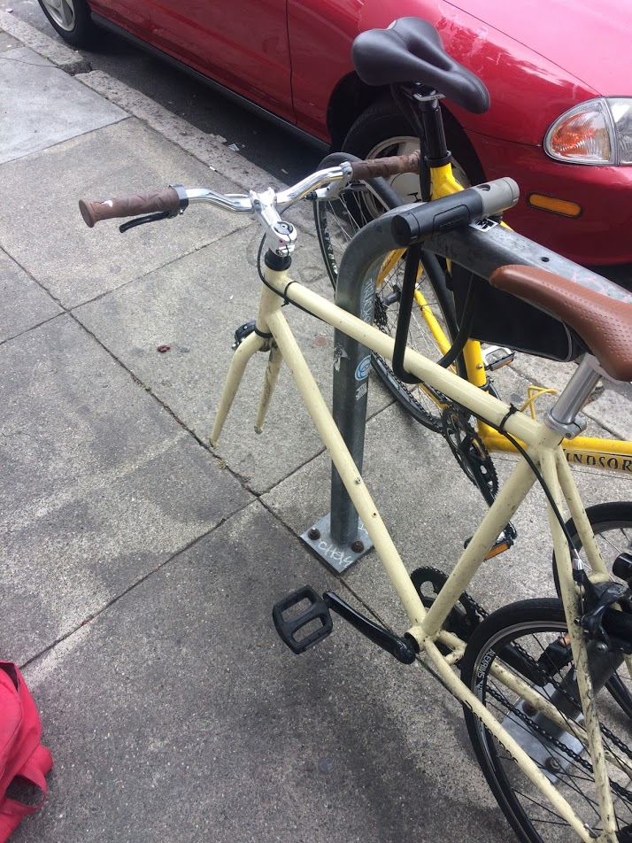

I was also on a single speed bike, which wasn’t easy with MASSIVE hills in San Francisco.

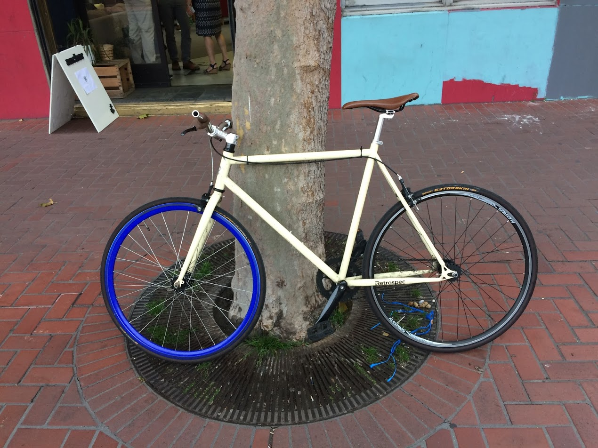

I met some great couriers. Shout out to Bryan and Roy, who were really great buddies to see out there and talk to. 

And after working my butt off for 4 months, I made JUST enough money to attend App Academy!!!

(Also including maxing out a credit card and not paying taxes too 😅😬) 

### App Academy

I was in the December cohort.

The first 2 weeks weren’t too tough, but it definitely sped up after that.

The way App Academy works, there are 6 tests, and if you fail 2, you get kicked out, which was incredibly stressful. I failed the third test, but thankfully passed the rest.

One mistake I made was not spending enough time with the people in my cohort. It was tough because I wanted to spend all my time on homework and coding because this was it for me, this was my shot, I couldn’t afford to get kicked out, or not be 100% prepared coming out of App Academy. But, I should’ve spent some time with my cohort-mates, and I regret that.

We built 3 projects. The last 2 weeks were on data structures and algorithm interview questions, which I didn't find super helpful, cause I was still trying to finish my projects!

### The Job Search
One of my buddies who went to App Academy got a job in a month, and I assumed my job search would be the same.

It wasn’t. 

I sent out a TON of applications (1,000 when it was all said and done).

But I was terrible at technical interviews. I really struggled with the stuff in Cracking the Coding Interview. I was so confused.

And, the entire time I was job searching I delivered food at night to make ends meet.

A few months into the job search, the Breaking Into Startups guys (the podcast that initially motivated me to pursue a career as a software engineer), invited me to live with them!

Ruben’s brother, David, and David’s friend Rewel, were actually in my cohort at App Academy and were also moving in with them.

This was our room.

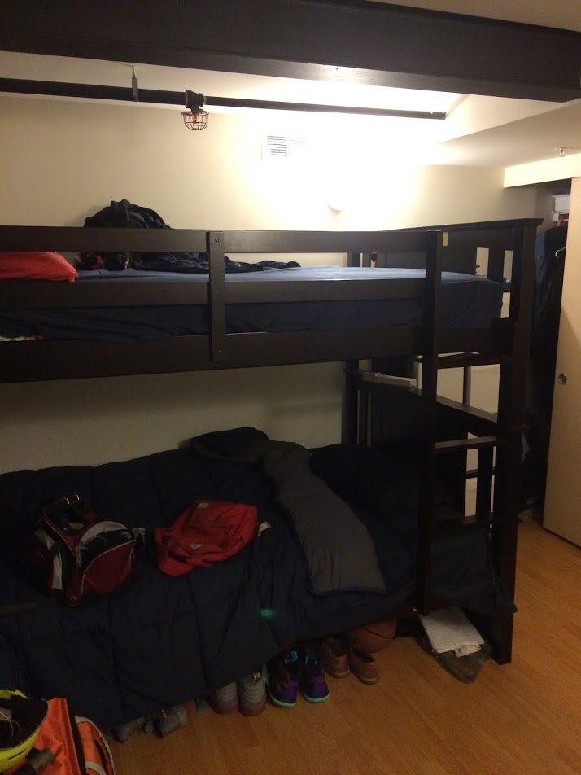

While living with them, they shared a [cold emailing strategy](https://www.facebook.com/meyster/videos/10211245064779073/?query=cold%20email) with us that had INCREDIBLE results.

Instead of a ~2% response rate, I was getting a ~50% response rate!

I got coffee meetings and interviews left and right, but, was still failing them all. But at least I was getting MANY more opportunities.

Just to give you an example of one of the interviews, there is a language called [brainfuck](https://esolangs.org/wiki/Brainfuck), which, like you, I had never heard of before. My interviewer gave me some code and we walked through it together. Then he wanted me to do a task with brainfuck 🤦‍♂️ Like, some of these interviews are insane. 

Eventually, though I reached out to a company in Utah, told them I recently moved to Salt Lake City (even though I was still in San Francisco) and was interested in what they were doing. 

I got a phone screen, which turned into an on-site. 

Problem was, they thought I was in SLC, so they weren’t paying for my flight, and I didn’t have the money for a last minute plane ticket. 

Thankfully my buddy was a flight attendant and I was able to use his buddy pass to get a flight knocked down from $500 to $160. Game changer. 

Flew there, had the interview and thankfully they didn't ask anything technical! 🙌

A few days later I got my first job offer!

It was very low (for what App Academy grads make), $62k, but I was able to bump them up to $67k.

I wanted to decline it and stay in San Francisco and hold out for that six-figure salary that my classmates were getting, but I was emotionally and physically exhausted from working almost every day for the last 1 year and 8 months. 

I needed a real job, downtime, health insurance, time to spend with friends, time for hobbies, and just some consistency in my schedule.

I knew that it would probably take many more months to land a job in San Francisco, and would rather spend those months working in the industry, than delivering food and building my own projects. 

So I accepted the offer!

So finally, the journey was over.

It was one hell of a ride. Great experience, learned a lot, but it was extremely difficult.

If I had to do it over again, [this is probably what I would've done](https://www.adrianhorning.com/should-i-go-to-a-coding-bootcamp/).

It's been a year and a half since I've been working, and I'm working at a new company in Utah, making $20k more, and my rent is only $500/month, so I'd say everything worked out pretty well 😁

Very Special Thanks to these People for helping to make it happen - 
* Ty Olatoye - The first person to help me in SF, and continued to help me. Motivated me to pursue software engineering. Helped me get a credit card. Can’t thank this man enough. 
* Chase Armstrong - Super helpful with answering questions and helping me pass App Academy’s technical portion.
* Shane Price - Great friend. Visited me in SF and helped me get that flight to SLC, Utah
* Jonathan Tso - Gave me the phone screen for the HR position at App Academy. Would’ve never know about App Academy if it wasn’t for him.
* Bill Zito - Took time to give me a mock interview to prep for Hack Reactor interview. 
* Ruben Harris, Artur and Timur Meyster - Their podcast inspired me and gave me the confidence to learn how to code. And they let me live with them, and their amazing cold emailing strategy they shared.
* David Harris - Emotional support and friend while we lived together
* Rewel - Emotional support during job search and delivering
* Porfy, Adrian Jewell, Steven, Nick, Ashil - Good guys who I lived with at Cohort-X. Helped me in too many ways to relate here.
* Bryan Pino Goebel - Great friend, another fellow courier
* Roy - Courier who was extremely friendly and positive. Needed that. 
* Dylan O’Carroll - Was the first person I met who helped me with learning JavaScript and get into Hack Reactor. He didn't know me from Adam, but was still willing to help.
Craig Smith - Spent time answering my questions about Hack Reactor and the job search, even though he didn't know me very well.
* Jon Deng - Spent time answering my questions about Hack Reactor and the job search
