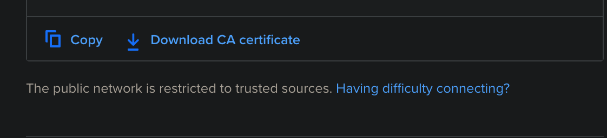

### Tech Stack

- Node.js
- Express
- PostgreSQL
- Typescript
- Note: this is just my backend code. Frontend is in a different repo.

### Issues

The title is actually a little misleading 😅 I'm not walking through the exact process, cause it's not very complicated and there are a log of existing resources.

But the problems I ran into weren't well documented, so that's what I'm documenting here.

### Database

The first was that to use a database it was a minimum of $7/month extra for the dev database. I thought it was $5 for server + database, so that was kind of a bummer.

I chose to use the managed database database, which was $15, so I'm at $20/month.

Also, at the moment the database has to be open to all sources because of the floating IP addresses from the App Platform, which is super lame. Hopefully that changes soon.

Community posts about this:
https://www.digitalocean.com/community/questions/how-to-add-my-digitalocean-app-as-a-trusted-resource-for-my-managed-database

https://www.digitalocean.com/community/questions/app-platform-bug-cant-set-as-a-trusted-source-for-database-cluster

### tsc: command not found

The second thing was when my build script ran, which was

```json
"build": "tsc"
```

I got an error, `tsc: command not found`

Apparently I needed to install the dev dependencies, so using

```json
"build": "npm install --only=dev && tsc"
```

worked.

Here are some community posts discussing this:

https://www.digitalocean.com/community/questions/app-platform-keeps-using-cached-node_modules-despite-changes

https://www.digitalocean.com/community/questions/how-do-you-use-node-js-devdependencies-in-the-app-platform-builds

### SSL Certificate

This one was the greatest pain.

When trying to make a request to the app I kept getting:
`Error: self signed certificate in certificate chain`

To fix it, first you need to set an environment variable in the app platform.

Go to the Components tab and specify a `CA_CERT` environment variable and set it to `${name-of-your-service.CA_CERT}`

Here is the DO doc talking about environment variables:

https://www.digitalocean.com/docs/app-platform/how-to/use-environment-variables/

Then you need to reference that when you instantiate the DB connection.

I'm using `node-postgres` https://www.npmjs.com/package/pg

```ts
const pool = new Pool({
  user: process.env.USERNAME,
  host: process.env.HOSTNAME,
  database: process.env.DATABASE,
  password: process.env.PASSWORD,
  port: process.env.PORT,
  ssl: {
    rejectUnauthorized: true,
    ca:
      process.env.NODE_ENV === PRODUCTION
        ? process.env.CA_CERT
        : fs.readFileSync("ca_cert.crt").toString(),
  },
})
```

Note that I am not using the `connectionString` parameter. For some reason that doesn't work.

I posted a question here, hopefully it gets answered:
https://github.com/brianc/node-postgres/issues/2009

Also note that I am separating how I reference the certificate on prod vs dev

```ts
  process.env.NODE_ENV === PRODUCTION
    ? process.env.CA_CERT
    : fs.readFileSync("ca_cert.crt").toString(),
```

I have no idea if that is best practice, but locally, you can't stick the cert in an env variable, so, that's the best I could come up with.

To get that cert, you need to download the CA certificate from the DO managed database.

When you go to your managed database, there is a button below the connection details.



You have to open the cert with a code editor, I used VS Code.

Then just copy the contents and create a new file in your repo, paste the contents, then reference it like I did above.

Hope that helps.
