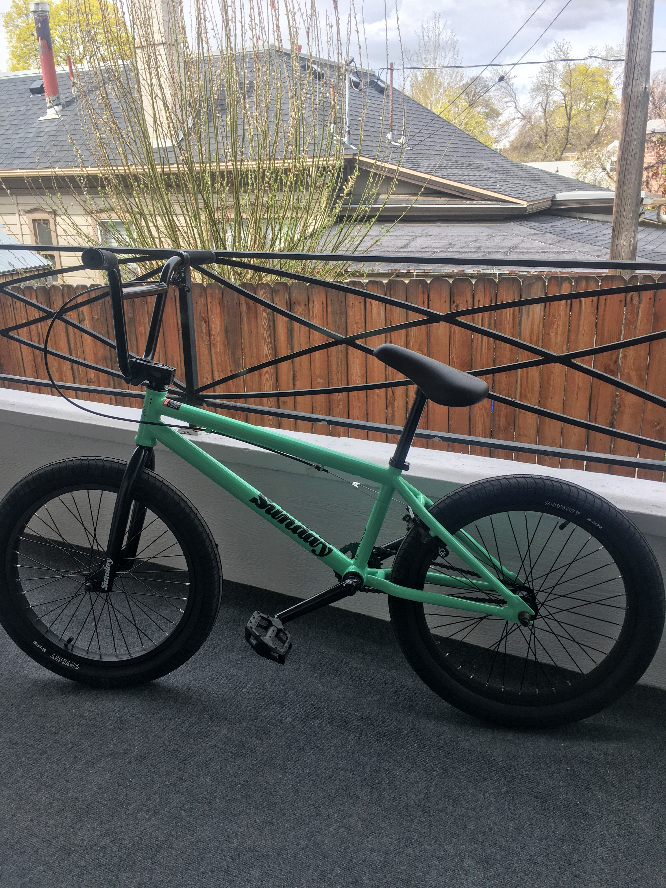

Probably like most kids in the early 2000's, I had a BMX bike and jumped little dirt jumps. But by the time I was in high school, my interest waned and I sold the bike.

Fast forward 15 years and I'm buying another BMX bike.

Why?

* I didn't do any huge jumps as a kid, I was too scared. I want to face and overcome the fear I had as a kid. I want to prove to myself I can do it.
* There's nothing else to do in quarantine 😆🤷‍♂️ And this seems like a perfect social distancing activity. 
* I'm trying to develop more hobbies that I can do for fun and meet people
* Jumping those jumps looks like a rush and a ton of fun